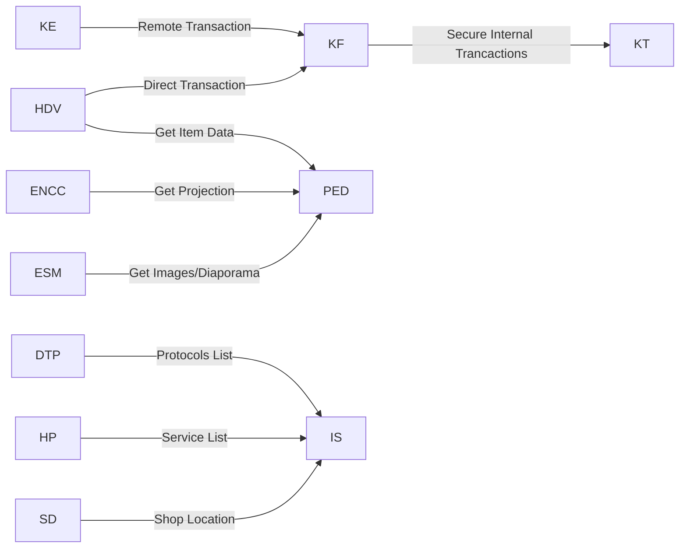

# SwitchCraft ENC
Switchcraft Exchange and Networking Center
# Services
Information in ENC databases can be manually verified to avoid any false information.
  
|Short Name|Name| 
 |:-:|:-:| 
 |KF|[Float Krist](https://github.com/SmallGolem/SwitchCraft-ENC-Programs/tree/main/KF)|
 |KT|[Krist transaction](https://github.com/SmallGolem/SwitchCraft-ENC-Programs/tree/main/KT)| 
 |KE|[Krist transfert](https://github.com/SmallGolem/SwitchCraft-ENC-Programs/tree/main/KE)| 
 |ENCC|[Cinema](https://github.com/SmallGolem/SwitchCraft-ENC-Programs/tree/main/ENCC)| 
 |IS|[Indexing System](https://github.com/SmallGolem/SwitchCraft-ENC-Programs/tree/main/IS)| 
 |HDV|[Common Shop](https://github.com/SmallGolem/SwitchCraft-ENC-Programs/tree/main/HDV)| 
 |IT|[Item Transfert](https://github.com/SmallGolem/SwitchCraft-ENC-Programs/tree/main/IT)|
 |DTP|[Data Transfert Protocol](https://github.com/SmallGolem/SwitchCraft-ENC-Programs/tree/main/DTP)|
 |HP|[Helper Program](https://github.com/SmallGolem/SwitchCraft-ENC-Programs/tree/main/HP)|
 |SD|[Shop Data](https://github.com/SmallGolem/SwitchCraft-ENC-Programs/tree/main/SD)|
 |PED|[Private ENC Database](https://github.com/SmallGolem/SwitchCraft-ENC-Programs/tree/main/PED)|
 |ESM|[External Screen Management](https://github.com/SmallGolem/SwitchCraft-ENC-Programs/tree/main/ESM)|
  
## Details: 

|Short Name|Description|Requirements| 
 |:-:|:-|:-:| 
 |KF|non-integer krist transfer|KT| 
 |KT|Internal ENC tool to handle krists sent to specific adress| 
 |KE|krist transfer without ingame commands|KF| 
 |ENCC|A cinema under the ENC centre|PED|
 |IS|System to index each stores, system, port usage, ect| 
 |HDV|Store where everyone can put items on sale (will integrate an auction system)|PED, KF|
 |IT|Remote item exchange system (will integrate a cloud for items)| 
 |DTP|Data transfer protocol to avoid incompatibilities|IS| 
 |HP|Integration of a help and help command to give indications on the operation of switchcraft and these stores, system, ect|IS|
 |SD|Integration to overlay glass for indicate information for specific shop on player is at front of him|IS|
 |PED|Database of ENC for ENC services||
 |ESM|Program for managing what's showing of screens at front of ENC|PED|
 
  

# Center
The center of ENC is a building for host all ENC services, make physical interaction (like shop and cinema) and host ads.
In floors 1 to 6, there are 2 outing for elytra per floor.
The building reduces its CO2 production for the environment and refuses to be paid to install a polluting fireplace.
## Floors
|Floor|Use|
|:-:|:-|
|Roof|Natural park in the sky and gps antenna|
|Floor 6||
|Floor 5||
|Floor 4||
|Floor 3||
|Floor 2||
|Floor 1|Raffle of LightningReflex|
|RDC|Common Shop|
|Basement 1|Entrance of the cinema and show what will be the next screening at the cinema|
|Basement 2|Cinema|
|Basement 3|System's computers|
|Basement 4|Storage|
|Basement 5|transformations (to craft, heat, wet, ... items)|
