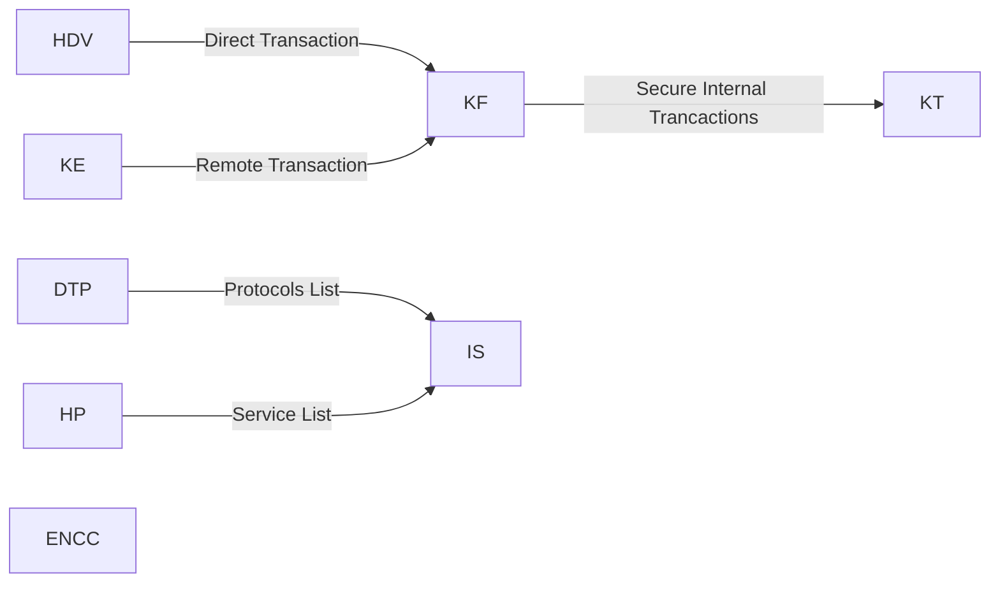

# ENC

|Short Name|Name|
|:-:|:-:|
|KF|Float Krist|
|KT|Krist transaction|
|KE|Krist transfert|
|ENCC|Cinema|
|IS|Indexing System|
|HDV|Common Shop|
|IT|Item Transfert|
|DTP|Data Transfert Protocol|
|HP|Helper Program|

## Details:

|Short Name|Description|Requirements|
|:-:|:-:|-:|
|KF|non-integer krist transfer|KT|
|KT|Internal ENC tool to handle krists sent to specific adress|
|KE|krist transfer without ingame commands|KT, KF|
|ENCC|A cinema under the ENC centre|
|IS|System to index each stores, system, port usage, ect|
|HDV|Store where everyone can put items on sale (will integrate an auction system)|
|IT|Remote item exchange system (will integrate a cloud for items)|
|DTP|Data transfer protocol to avoid incompatibilities|IS|
|HP|Integration of a \help and \help command to give indications on the operation of switchcraft and these stores, system, ect|IS|

